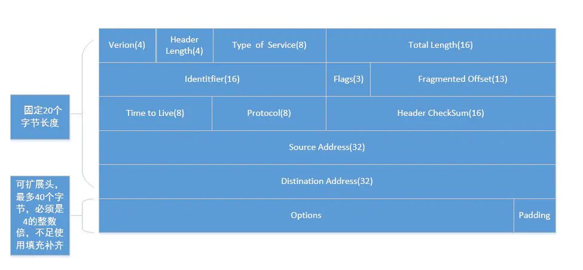

 - **Version（版本号）**：IP 协议版本号。目前只有两个版本：IPv4 和 IPv6

 - **Header Length（IP 协议头部长度）**：IP 协议头部的长度，单位字节（32 bit）需要这个值是因为任选字段的长度是可变的， 这个字段占4bit（最多能表示15个32bit的的字，即4*15=60个字节的首部长度），因此IP 头部最多有60字节长度。正常的长度是20字节； 如果有额外的 IP 的 options 选项，还得加上 option 的长度。

 - **Type of Service (服务类型)**：标示包传输优先级。总共8位，是由3个优先权位（不再使用），4个 TOS 位，1个固定的0组成。
4个 TOS 位：最新延迟、最大吞吐量、最高可靠性、最小成本，只能4选一。\
8位 按位被如下定义 PPP DTRC0
    > PPP：定义包的优先级，取值越大数据越重要（不再使用）

     000 普通 (Routine) \
     001 优先的 (Priority) \
     010 立即的发送 (Immediate) \
     011 闪电式的 (Flash) \
     100 比闪电还闪电式的 (Flash Override) \
     101 CRI/TIC/ECP(找不到这个词的翻译) \
     110 网间控制 (Internetwork Control) \
     111 网络控制 (Network Control) 

    > DTRC0

    D 时延: 0:普通 1:延迟尽量小 \
    T 吞吐量: 0:普通 1:流量尽量大 \
    R 可靠性: 0:普通 1:可靠性尽量大 \
    M 传输成本: 0:普通 1:成本尽量小 \
    0 最后一位被保留，恒定为0 

 - **Total Length（包长度）**：整个IP包的长度，16位，最大可以标示 65536个字节，Total Length - Header Length = 数据长度。通过 Header Length 和 Total Length 就可以知道数据的起始位置和结束位置。

 - **Identifier（标识符）**：网络中转发的IP报文的长度可以不同，但如果报文长度超过了数据链路所支持的最大长度，则报文就需要分割成若干个小的片段才能在链路上传输。比如以太网帧中数据最大长度（MTU）为 1500字节，大于 MTU 的都会被分割，被分割的每个包都有相同的一个值，表示这是同一个 ip 包。

 - **Flag（标志位）**： 标志字段在IP报头中占3位。

    第1位作为保留；\
    第2位，分段，是否允许分片;（如果不允许分片，包超过了数据连路支持的最大长度，则丢弃该包，返回发送者一个 ICMP 错误）\
    第3位，更多分段。表示是否最后一个分片。\
    当目的主机接收到一个IP数据报时，会首先查看该数据报的标识符，并且检查标志位的第3位是置0或置1，以确定是否还有更多的分段。如果还有后续报文，接收主机则将接收到的报文放在缓存直到接收完所有具有相同标识符的数据报，然后再进行重组。

 - **Fragmented Offset（偏移量）**： 当某个 IP 大包分成多片时，各个分片是不按顺序达到目的地的，IP 包根据分片的偏移量进行重组包。（跟TCP 原理一样）

 - **（Time to Live）生存时间**：表示数据包经过的路由器个数。如果网络上有些路由器的路由表配置不合理，路由寻址可能会导致死循环，数据包会一直循环传输。 IP 包发送的时候可以设置一个 TTL 值，比如 TTL=64，没经过一个路由器 TTL 减1，减到0 还没到到目的地，路由器会抛弃这个IP包，并使用一个ICMP消息通知发送方。

 - **Protocal（协议）**： 
    - 协议类型: 
      1 ICMP
      2 IGMP
      6 TCP
      17 UDP
      88 IGRP
      89 OSPF

 - **Header CheckSum（首部校验和）**：校验 IP 协议头，判断IP协议头是否正确传输。
   因为每个路由器要改变TTL的值,所以路由器会为每个通过的数据包重新计算这个值。
 
 - **Source Address（源IP）**： 请求方 IP

 - **Distination Address（目的IP）**： 响应方 IP\
   要注意除非使用NAT，否则整个传输的过程中，这两个地址不会改变。

 - **Options（可选字段）**： IP支持很多可选选项。
   - 可选项目包含以下内容：
      - 松散源路由（Loose source routing）：给出一连串路由器接口的IP地址。IP包必须沿着这些IP地址传送，但是允许在相继的两个IP地址之间跳过多个路由器。 
      - 严格源路由（Strict source routing）：给出一连串路由器接口的IP地址。IP包必须沿着这些IP地址传送，如果下一跳不在IP地址表中则表示发生错误。 
      - 路由记录（Record route）：当IP包离开每个路由器的时候记录路由器的出站接口的IP地址。 
      - 时间戳（Timestamps）：当IP包离开每个路由器的时候记录时间。
      
   填充（Padding）：因为IP包头长度（Header Length）部分的单位为32bit，所以IP包头的长度必须为32bit的整数倍。因此，在可选项后面，IP协议会填充若干个0，以达到32bit的整数倍。
